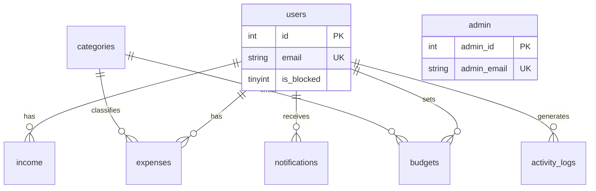

# Entity Relationship Diagram

## Tables

- **users** — registered users (`is_blocked` for admin control)
- **admin** — administrators (separate auth)
- **categories** — expense categories (normalized lookup)
- **income** — user income records
- **expenses** — user expenses (FK → users, categories)
- **budgets** — per-user monthly category budgets
- **budget_alerts** — overspending history
- **notifications** — user alerts (trigger-generated)
- **activity_logs** — audit trail (trigger-generated)
- **monthly_totals** — denormalized cache (trigger-updated)

## Relationships

```text
users 1───* income
users 1───* expenses
users 1───* budgets
users 1───* notifications
users 1───* activity_logs
users 1───* monthly_totals
categories 1───* expenses
categories 1───* budgets
```

## SQL Objects

| Type | Name |
|------|------|
| View | monthly_expense_summary |
| View | category_wise_expenses |
| View | user_financial_summary |
| View | top_spending_users |
| Procedure | GetMonthlySummary |
| Procedure | sp_generate_monthly_report |
| Procedure | sp_calculate_total_savings |
| Procedure | sp_category_analysis |
| Procedure | sp_detect_overspending |
| Trigger | trg_budget_alert_after_expense |
| Trigger | trg_expense_activity_log |
| Trigger | trg_income_activity_log |
| Trigger | trg_update_monthly_totals_expense |
| Trigger | trg_update_monthly_totals_income |

## Mermaid ER


